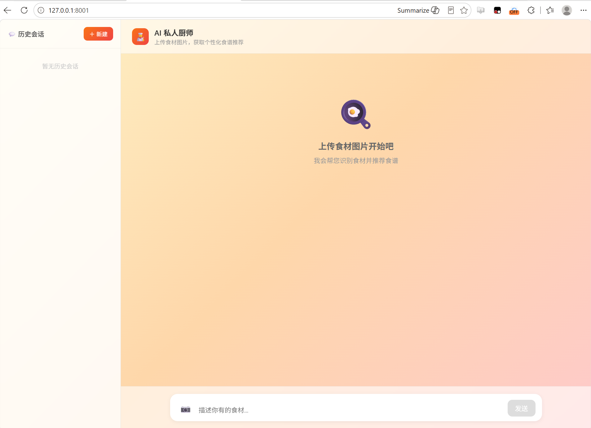

# 👨‍🍳 私厨助手（Personal Chief）

> AI 私人厨师智能体 — 上传食材照片或输入食材清单，自动识别食材、搜索食谱、评分排序、分析营养、推荐健身餐。



## 快速体验

```bash
# 1. 安装依赖
pip install -e .

# 2. 配置环境变量（.env）
DASHSCOPE_API_KEY=your_key
DASHSCOPE_BASE_URL=https://dashscope.aliyuncs.com/compatible-mode/v1
TAVILY_API_KEY=your_key
OSS_ACCESS_KEY_ID=your_key
OSS_ACCESS_KEY_SECRET=your_secret
OSS_BUCKET=your_bucket

# 3. 启动服务
python -m app.main

# 4. 浏览器打开 http://127.0.0.1:8001
```

## 功能特性

- 🧠 **多智能体架构** — Supervisor 调度三个子 Agent（做菜/营养/健身），按意图路由
- 🛑 **Human-in-the-loop** — 推荐食谱前暂停询问忌口偏好，用户回复后恢复执行
- 🔍 **双路检索** — Web 搜索（Tavily）+ 本地 RAG 知识库（ChromaDB）
- 🖼️ **多模态识别** — 通义千问 VL 视觉模型识别食材图片
- 💬 **流式对话** — SSE 实时流式输出 + Markdown 渲染
- 📋 **历史会话** — SQLite 持久化记忆，支持会话列表/切换/删除
- ☁️ **OSS 图片上传** — 阿里云 OSS 预签名 URL 直传

## 架构设计

```
用户输入
    ↓
Supervisor（判断意图）
    ├── recipe    → analyze → retrieve → 问忌口(HITL) → 评分输出
    ├── nutrition → nutrition_agent → 营养分析
    └── fitness   → fitness_agent → 健身食谱（自提取食材+联网搜索）
```

### 智能体说明

| 智能体 | 功能 | 技术亮点 |
|--------|------|----------|
| **Supervisor** | 判断用户意图，路由到子 Agent | LLM 意图分类 + 条件边路由 |
| **做菜 Agent** | 识别食材 → 检索食谱 → 评分排序 | 双路检索 + RAG + HITL |
| **营养 Agent** | 分析食材营养数据 | 结构化学输出 |
| **健身 Agent** | 推荐高蛋白低脂健身餐 | 自提取食材 + 联网搜索 |

## 技术栈

| 组件 | 技术 |
|------|------|
| Agent 框架 | LangGraph（手写 StateGraph + HITL） |
| 视觉模型 | 通义千问 VL（DashScope） |
| Web 搜索 | Tavily |
| 向量数据库 | ChromaDB |
| Embedding | DashScope text-embedding-v3 |
| 记忆 | SQLite（SqliteSaver） |
| 后端 | FastAPI |
| 图片存储 | 阿里云 OSS |
| 前端 | 纯 HTML + JavaScript + Marked.js |

## 项目结构

```
app/
├── agents/personal_chief.py   # LangGraph Agent（核心：Supervisor + 3个子Agent）
├── api/v1/
│   ├── chat.py                # 对话接口（流式/历史/删除/列表）
│   └── oss.py                 # OSS 预签名上传
├── rag/
│   ├── recipe_knowledge.py    # RAG 检索工具
│   └── recipe/                # 菜谱数据
├── models/schemas.py          # 数据模型
├── common/logger.py           # 日志配置
├── static/
│   ├── index.html             # 前端页面
│   └── screenshot.png         # 界面截图
└── main.py                    # 服务入口
```

## 接口文档

| 接口 | 方法 | 说明 |
|------|------|------|
| `/api/v1/chat/stream` | POST | 流式对话（支持 HITL 恢复） |
| `/api/v1/chat/messages?thread_id=` | GET | 查看历史消息 |
| `/api/v1/chat/messages?thread_id=` | DELETE | 删除会话 |
| `/api/v1/chat/threads` | GET | 获取会话列表 |
| `/api/v1/oss/presign?filename=` | GET | 获取图片上传链接 |
